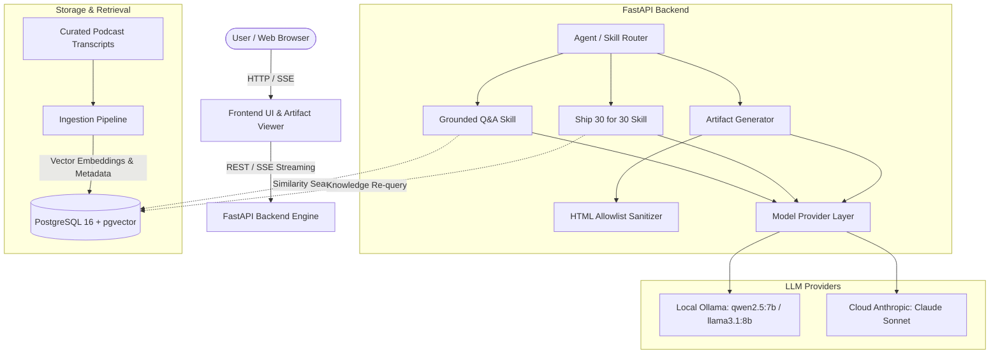
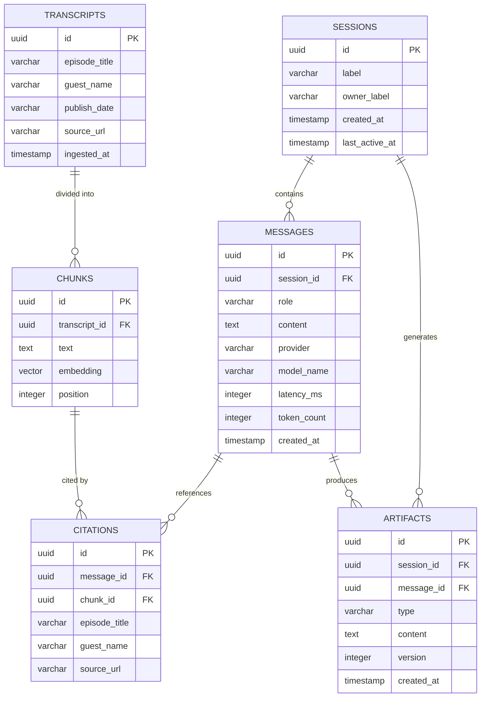

# System Architecture Specification

# The Lenny Growth Assistant
**Author**: Riju Pradhanang  
**Document Version**: 2.0  
**Status**: Production Ready  

---

## 1. High-Level Architecture Overview

The Lenny Growth Assistant is built as a full-stack, modular AI application comprising a FastAPI backend, a React/HTML5 responsive frontend with an interactive Artifact Viewer, and a PostgreSQL database equipped with the `pgvector` extension for semantic vector similarity search.



---

## 2. Database Schema (PostgreSQL + pgvector)



---

## 3. API Surface & SSE Protocol

### 3.1 REST Endpoints

| Endpoint | Method | Request Payload | Response / Purpose |
|---|---|---|---|
| `/health` | `GET` | — | Returns `{ "status": "ok", "dependencies": { "database": { "status": "up" } } }`. Returns HTTP 503 if degraded. |
| `/config` | `GET` | — | Returns `{ "provider": "ollama", "model": "qwen2.5:7b", "fallback_provider": null }` for UI state. |
| `/sessions` | `POST` | `{ "label": str, "owner_label": str }` | Creates a new chat session; returns HTTP 201 with session metadata. |
| `/sessions` | `GET` | — | Lists all sessions ordered by `last_active_at DESC`. |
| `/sessions/{id}/messages` | `GET` | — | Returns full message history for the session with citations. |
| `/sessions/{id}/chat` | `POST` | `{ "content": str }` | Initiates SSE stream containing intent, tokens, citations, and completion event. |
| `/sessions/{id}/artifacts` | `POST` | `{ "type": "markdown" \| "html", "prompt": str, "message_id": uuid }` | Generates a versioned, sanitized artifact from conversation context. |
| `/sessions/{id}/artifacts` | `GET` | — | Lists all artifacts generated for the session. |
| `/artifacts/{id}` | `GET` | — | Retrieves a specific artifact by ID for rendering or raw download. |
| `/sessions/{id}` | `DELETE` | — | Cascades deletion of session, messages, and associated artifacts. |

### 3.2 SSE Event Stream Protocol (`/sessions/{id}/chat`)

The chat endpoint uses Server-Sent Events (SSE) to deliver real-time feedback:

1. `event: intent`  
   `data: {"intent": "grounded_qa" | "essay" | "artifact"}`
2. `event: token`  
   `data: {"text": "string token fragment"}`
3. `event: citations`  
   `data: {"items": [{"chunk_id": "...", "episode_title": "...", "guest_name": "...", "source_url": "..."}]}`
4. `event: validation` *(emitted for essays)*  
   `data: {"is_valid": true, "word_count": 1180, "has_headings": true, "has_bullets": true, "has_bold": true, "has_takeaway": true, "feedback": []}`
5. `event: done`  
   `data: {"message_id": "...", "provider": "ollama", "model": "qwen2.5:7b", "intent": "..."}`
6. `event: error` *(on failure)*  
   `data: {"code": "provider_unavailable" | "database_unavailable", "message": "human readable detail"}`

---

## 4. Agent Routing & Skill Architecture

The agent router (`classify_intent`) inspects incoming user prompts using rule-based and keyword heuristics to route deterministically without adding unnecessary latency:

1. **Grounded Q&A Skill**:
   - Fetches vector embeddings of the user query via Ollama `nomic-embed-text`.
   - Executes pgvector similarity query: `SELECT ... WHERE embedding <=> :vector <= :threshold ORDER BY distance ASC LIMIT :limit`.
   - System prompt constrains the model to answer exclusively from the provided excerpts and cite sources.
   - If chunks are below threshold, returns an explicit, polite abstention response.

2. **Ship 30 for 30 Content Skill**:
   - Re-queries the vector index for comprehensive context.
   - Applies the Ship 30 for 30 prompt template: strong hook, 1 idea per essay, short 1-2 sentence paragraphs, bolded emphasis, bulleted takeaways, ~1,250 words target.
   - Post-generation structural validator verifies word count (1,050–1,450 words), presence of markdown headers, bullets, bold emphasis, and a designated takeaway section.

3. **Artifact Generator & Sanitizer**:
   - Synthesizes conversation context into clean Markdown documents or modern, self-contained HTML/CSS widgets.
   - Applies the server-side allowlist sanitizer (`sanitizer.py`) before storage.

---

## 5. Security & Artifact Sandboxing Pipeline

To prevent Cross-Site Scripting (XSS) and code injection, untrusted model-generated content passes through a two-stage security boundary:

1. **Server-Side Allowlist Sanitization**:
   - Strips all `<script>`, `<applet>`, `<embed>`, `<object>`, `<iframe>`, `<form>`, `<input>`, `<button>` tags.
   - Removes all inline JavaScript event handlers (`onclick`, `onload`, `onerror`, `onmouseover`, etc.).
   - Disallows `javascript:`, `vbscript:`, and `data:` URIs in `href` and `src` attributes.
   - Permits only safe structural and semantic HTML tags (`<div>`, `<p>`, `<span>`, `<h1>`–`<h6>`, `<ul>`, `<ol>`, `<li>`, `<table>`, `<thead>`, `<tbody>`, `<tr>`, `<th>`, `<td>`, `<strong>`, `<em>`, `<code>`, `<pre>`, `<style>`).

2. **Client-Side Iframe Sandboxing**:
   - HTML artifacts are rendered inside an `<iframe>` configured with:
     ```html
     <iframe sandbox="allow-same-origin" srcdoc="..."></iframe>
     ```
   - Noticeably omits `allow-scripts` and `allow-top-navigation`, ensuring no executable script can run in the client browser.

---

## 6. Observability & Structured Logging

Every request is assigned a unique `X-Request-ID` (received via header or generated via `uuid4`). Requests are logged in structured JSON format with:
- `request_id`: Traces request lifecycle.
- `route`: Endpoint path.
- `method`: HTTP method.
- `status_code`: HTTP response status.
- `latency_ms`: Execution time in milliseconds.
- `provider`: Active LLM provider used.

---

## 7. Deployment Topology

The system is containerized with Docker Compose:
- **`postgres`**: `pgvector/pgvector:pg16` with persistent volume `pgdata`.
- **`backend`**: Python 3.11/FastAPI backend with automatic Alembic migrations on startup.
- **`frontend`**: Lightweight Nginx/Caddy static server serving the responsive UI.
- **`ollama`**: Runs on the host machine (`http://host.docker.internal:11434`), allowing hardware GPU acceleration.
